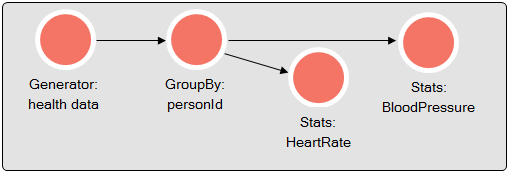

<!--
   Licensed to the Apache Software Foundation (ASF) under one or more
   contributor license agreements.  See the NOTICE file distributed with
   this work for additional information regarding copyright ownership.
   The ASF licenses this file to You under the Apache License, Version 2.0
   (the "License"); you may not use this file except in compliance with
   the License.  You may obtain a copy of the License at

       http://www.apache.org/licenses/LICENSE-2.0

   Unless required by applicable law or agreed to in writing, software
   distributed under the License is distributed on an "AS IS" BASIS,
   WITHOUT WARRANTIES OR CONDITIONS OF ANY KIND, either express or implied.
   See the License for the specific language governing permissions and
   limitations under the License.
-->

# GroupByActor
The `GroupByActor` is a [Coral Actor](/actors/overview/) that can partition an event stream based on unique values of
one or more input field(s). The `GroupByActor` will relay messages to the correct actor(s), depending on the value of
the input field(s), and will create a child actor(s) for values that it did not see before.

## Creating a GroupByActor
The `GroupByActor` is especially useful in combination with state full actors, such as [StatsActor](Actors-StatsActor.html).
A `GroupByActor` can trigger multiple [Coral Actor](/actors/overview/), including an other `GroupByActor`. For each
emit-target the `GroupByActor` will create a child-actor for distinct values of the group by field(s) and relays the
JSON to this child-actor.

#### Example
 

 
The JSON looks as follows:

{
  "name": "runtime1",
  "actors": [{
    "type": "kafka-consumer",
    "params": {
    "topic": "healthstream",
    "kafka": {
     "zookeeper.connect": "localhost:2181",
     "group.id": "mygroup"
    }
  }, {
    "name": "groupbyPerson",
    "type": "groupby",
    "params": {
      "field": "personid" or: "fields": \["personid"\]
    }
  }, {
    "name": "heartrate",
    "type": "stats",
    "params": {
      "field": "heartbeat"
    }
  }, {
    "name": "bloodpressure",
    "type": "stats",
    "params": {
      "field": "bloodpressure"
    }
  }], "links": [
   { "from": "kafka-consumer", "to": "groupbyPerson" },
   { "from": "groupbyPerson", "to": "stats1" },
   { "from": "groupbyPerson", "to": "stats2" }
  ]
}


In this example, a `GroupByActor` is  being created, which partitions the JSON by the field 'personid'. It creates for
every distinct value of the 'personid' field two child-Actors (both of type `StatsActor`), if not already created, and
relays the JSON to these child-actors.
The following URLs can be used to retrieve the state values.
 
 URL | action
 ---: | :--
 [GET&nbsp;/api/runtimes/<b>runtime1</b>/actors/<b>groupbyPerson</b>/<b>personid</b>/<b>heartrate</b>/state] | Get state (avg, min/max. etc) of actor `heartrate` for the specific distinct value determined by `groupbyPerson`.
 [GET&nbsp;/api/runtimes/<b>runtime1</b>/actors/<b>groupbyPerson</b>/<b>personid</b>/<b>bloodpressure</b>/state] | Get state (avg, min/max. etc) of actor `bloodpressure` for the specific distinct value determined by `groupbyPerson`.

## Trigger
The `GroupByActor` reads the value of the group by field from the trigger JSON. If such a field is found, the JSON will
be relayed as trigger for the corresponding underlying actor(s). For a newly encountered value new actor(s) will be created.
If the group by field is not found, nothing is done.

## Emit
The `GroupByActor` does not emits the trigger JSON to the child actor(s).

## State
The `GroupByActor` does not keep state.

## Collect
The `GroupByActor` does not collect state from other actors.

## Timer
The `GroupByActor` does not have a timer function implemented.