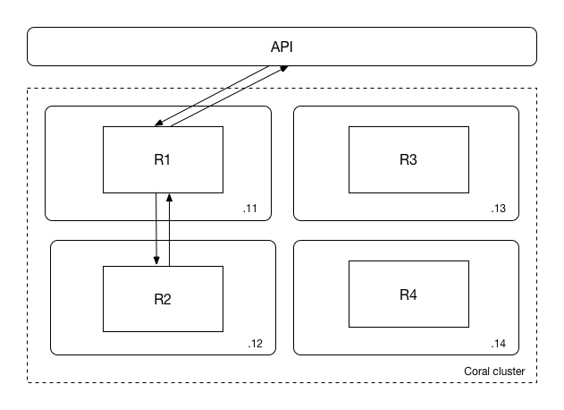
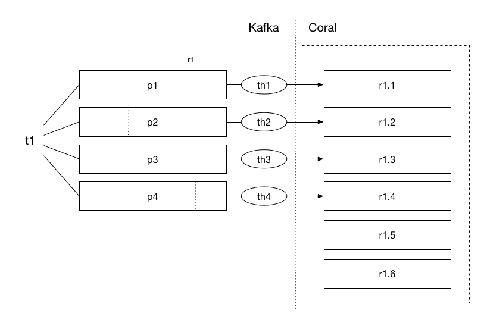
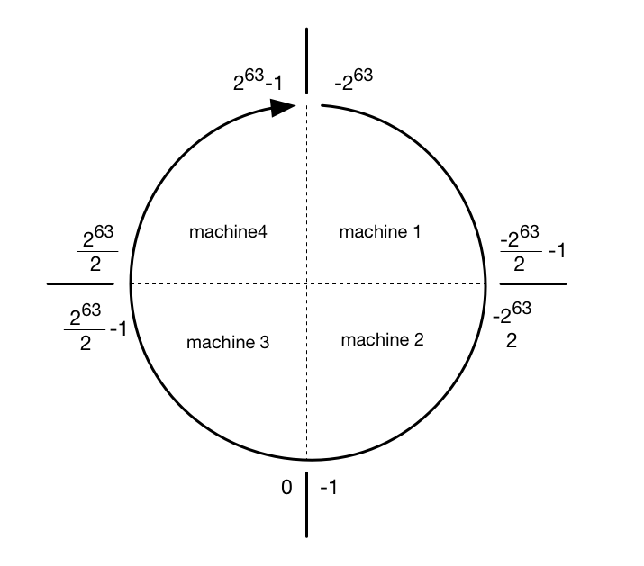
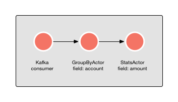
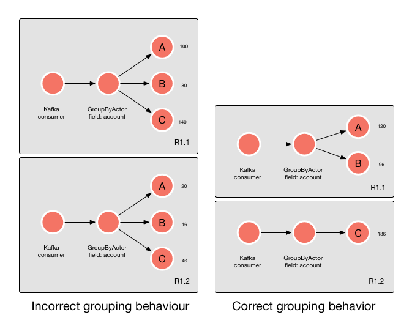

<!--
   Licensed to the Apache Software Foundation (ASF) under one or more
   contributor license agreements.  See the NOTICE file distributed with
   this work for additional information regarding copyright ownership.
   The ASF licenses this file to You under the Apache License, Version 2.0
   (the "License"); you may not use this file except in compliance with
   the License.  You may obtain a copy of the License at

       http://www.apache.org/licenses/LICENSE-2.0

   Unless required by applicable law or agreed to in writing, software
   distributed under the License is distributed on an "AS IS" BASIS,
   WITHOUT WARRANTIES OR CONDITIONS OF ANY KIND, either express or implied.
   See the License for the specific language governing permissions and
   limitations under the License.
-->

## Handling and forwarding

  - [Introduction](#introduction)
  - [Runtime copies](#runtimecopies)
  - [Event handling](#eventhandling)
    - [Kafka topics, groups and partitions](#kafkatopics)
    - [Forwarding](#forwarding)
    - [Murmur hashing](#murmurhashing)
  - [GroupByActor](#groupbyactor)
  
 

### Introduction

Coral is a completely headless/masterless architecture. This means that each node must be able to handle any HTTP request, whether the contacted node in the cluster is capable of answering the request or not. The same is true for handling events. If an event does not belong on a certain machine, it should be forwarded to the machine that can handle the event. This implies that all nodes must know where to forward requests to, if the node that is contacted is not capable of handling the request. This process is completely transparent to the consumer of the RESTful API and also has no effect on runtime behavior.

An example of a request to a Coral cluster with four nodes is shown below:

In the picture, a Coral cluster with 4 machines is shown, with IP addresses `192.168.0.11` to `192.168.0.14`. On each of these machines, four different runtimes run, named `R1` to `R4`. Let's assume that the user connects to the following URL: 


GET http://192.168.0.11/api/runtimes/runtime2/stats


This means that the user requests runtime statistics from a node on which the runtime does not run. Coral will automatically forward the request to node `192.168.0.12`, where the runtime actually lives. The end user simply sees the answer to the request as if the forwarding did not take place.

-----------------------------

### Runtime copies

In case only a single copy of a runtime runs, this process is fairly simple. It is also possible, however, to start multiple copies of the same runtime, distributed over multiple machines, as described [here](Documentation-ScalingOut.html). In this case, the process is more complicated.

When a runtime with multiple copies is created, both the runtime as a whole and each individual copy can be approached. When the runtime as a whole is contacted, any action is assumed to apply to all copies of the runtime. For instance, runtime statistics will be fetched for all copies, and actions such as starting or stopping a runtime are applied to all copies as well.

In the case that one copy is approached, the number of operations is more limited: only runtime statistics can be fetched. This is by design; any operation that changes the state of the runtime must be performed on the runtime itself, and not on the copy.

When obtaining statistics from copy 1 of runtime2, as shown below:


GET http://192.168.0.11/api/runtimes/runtime2.1/stats


Coral simply treats the runtime copy as a separate runtime and forwards the request to the copy, as in the picture above. 

When entering the following when multiple copies have been created:


GET http://192.168.0.11/api/runtimes/runtime2/stats


it means that statistics for *all* runtimes should be obtained, summed up, and returned as a total for runtime2 as a whole, as is shown in the picture below:

The process of aggregating statistics over all runtime copies is completely transparent for the end user.

-----------------------------

### Event handling

So far, we have only discussed handling and forwarding of manual requests to the RESTful interface. What about event processing by the runtime itself? In Coral, several mechanisms are at work to ensure that events are forwarded to the machine which should handle the event, without causing changes in desired runtime behavior.

To understand more about how Coral handles and forwards events, the architecture of Kafka needs to be explained a little bit more. For a more detailed explanation of Kafka, we refer to the [Kafka documentation](http://kafka.apache.org/documentation.html).

 

### Kafka topics, groups and partitions

Coral is built to process events coming from Kafka. Since Kafka can scale horizontally, Coral should scale horizontally as well to handle any load that Kafka provides to it. In order to better understand some of the design decisions of Coral, some concepts central to Kafka are explained first.

Kafka events are delivered in *topics*. An example is a topic called "clickstream", which contains JSON objects of each click of visitors on a website. To make a topic scale over multiple machines, Kafka divides its topics into *partitions*, which practically means that different parts of the event stream are written to disk on different machines. Together, all blocks combined comprise the whole topic. Kafka creates a *consumer thread* for each partition in a topic, which Coral can connect to. A single partition cannot be diviced into multiple consumer threads since it is the core concept of parallellism in Kafka and it ensures that offsets are increased atomically.

Each event in a topic must be assigned to a certain partition in the topic. To do this, a *consistent hash* is calculated on a certain key field in the event, which guarantees that the same key value will end up in the same partition. For instance, if a click event contains a "session ID" field, which denotes the session to which the click belongs to, all clicks for this session will end up in the same partition. This is important for Coral, because often, events with a certain key need to be processed on the same runtime copy in order to build state, as we will see later.

One final Kafka concept is the *group id*, which is the name for a group of consumers. Kafka tracks the offsets in a topic for each group id. For instance, if `runtime1` consumes the click stream topic and has processed 100 events, the marker for the group id for `runtime1` in the click stream topic will be at 100 events from the start. 

These concepts are important for Coral because Coral assigns a group id to a runtime and to all its copies. For instance, if four copies for `runtime1` are created, they share the same group id `runtime1`. This basically means that for the whole set of copies, Kafka will track how far the copies are in consuming the topic. Each Coral copy only receives data from a certain partition, as shown in the picture below.

In the picture, a topic is shown, `t1`, which is divided in four partitions, `p1` to `p4`. This means that there will be four different consumer threads, `th1` to `th4`. The group id of `runtime1` is also shown (`r1`) which keeps the offset in each partition for the runtime. 

This would mean that, without forwarding and hashing of events, Coral would only be able to have a maximum number of copies equal to the number of Kafka partitions. The other Coral copies, `r1.5` and `r1.6`, would be idle! 

 

### Forwarding

Of course, we have designed Coral in such way that it is possible to have more runtime copies than Kafka partitions. If we have the same number of Kafka partitions as Coral runtime copies, it means that each Coral runtime copy runs one Kafka consumer thread, and they all actively consume data from Kafka. If we increase the number of Coral copies without increasing the number of Kafka partitions, however, we can see that the extra copies are idle and do not consume any data from Kafka, as in the picture above. 

Coral deals with this situation by hashing the partition key of each incoming JSON event, and then deciding whether the copy belongs to the machine on which it was received. If this is not the case, it will be forwarded to another copy. Copies which do not actively consume from Kafka themselves thus get their data indirectly from copies that do have an active Kafka consumer thread. The other runtime copies do have consumer threads but Kafka does not actively give data to them. The benefit of this approach is that if a copy crashes or a machine goes down, the idle threads will take over consumption of the Kafka topic until the number of threads is again equal to the number partitions.

The ideal situation is when there are as much partitions as that there are runtime copies. You could wonder why you would need more runtime copies than Kafka partitions. Let's assume that a certain event takes 1 millisecond to process in a single runtime copy. This means that the theoretical maximum throughput for a single runtime copy is 1.000 events per second. If you have a topic which contains 10.000 events per second on average, and you have four partitions, this means that you have 2.500 events per second per partition. This is too much for a runtime copy to handle if you have only four runtime copies! If we create 10 copies, on the other hand, we receive 1.000 events per copy and now each copy has enough time to handle each request.

If you need more runtime copies than partitions, however, a certain amount of additional traffic will occurr due to the forwarding of messages. Although Coral can handle this without problems, you must be aware that this will generate additional traffic. The theoretical maximum amount of traffic generated due to forwarding is 2N, where N is the number of events. This happens when the number of runtime copies is much larger than the number of Kafka partitions, which makes the chance that a certain event belongs on the node that received the event close to zero, and it must thus forward the event (which doubles the amount of traffic).

 

### Murmur hashing

Coral knows where to forward events by calculating a Murmur hash of the key field. The Murmur hashing function transforms a text value into a number, which points to the address of the copy to where the message should be forwarded. Because each runtime copy knows which other copies of the runtime exist and what its addresses are, it can forward the event to the selected copy. If no partition key is provided, a random copy is chosen. This is conceptually the same as hashing the entire message. 

Below, an example of a so-called *token ring* is shown, which divides all possible hashed values into four machines:

If this looks familiar, that is because we have taken this concept from [Apache Cassandra](http://docs.datastax.com/en/cassandra/2.1/cassandra/architecture/architectureDataDistributeHashing_c.html). Thank you, Cassandra!

It is important to note that *manual* request forwarding is something else as *event* forwarding. Manual forwarding happens when a different node is contacted through the API than where the runtime runs. Event forwarding happens when Coral decides that the event does not belong on the machine which received the event.
Both processes are fully automatic and transparent so there is no need to worry about any of them.

-----------------------------

### GroupByActor

The [GroupByActor](Actors-GroupByActor.html) complicates forwarding and handling messages a bit, as is explained in this section.

To make stateful processing grouped by a certain field possible, the GroupByActor exists. For instance, if we want to keep the statistics over transaction amounts per account number, a GroupByActor can be connected to a StatsActor, as is shown in the picture below:

This will calculate statistics over the "amount" field per unique "account" field. Thus, statistics for account A will be collected separately from statistics of account B. As long as the Kafka partition key is also the account number, there is no problem for the GroupByActor. 

When the partition key is set to something else as the grouping key in Coral, a problem appears. Let's assume we want to calculate statistics per country instead of per account, but the partition key of Kafka is still set to account number. We have three countries, A, B and C. Since each of the three countries can appear in any partition, each GroupByActor will start to collect statistics for any unique country it encounters. The problem is that every copy of the GroupByActor does the same, resulting in separate statistics on different copies for the same country:

This is of course undesirable behavior. For this reason, the GroupByActor calculates the Murmur hash based on the grouping key and forwards the message to the appropriate GroupByActor copy if he is not the right copy to handle the grouping operation.