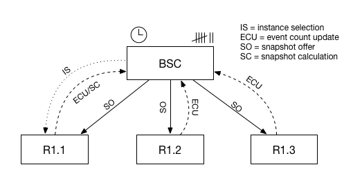

<!--
   Licensed to the Apache Software Foundation (ASF) under one or more
   contributor license agreements.  See the NOTICE file distributed with
   this work for additional information regarding copyright ownership.
   The ASF licenses this file to You under the Apache License, Version 2.0
   (the "License"); you may not use this file except in compliance with
   the License.  You may obtain a copy of the License at

       http://www.apache.org/licenses/LICENSE-2.0

   Unless required by applicable law or agreed to in writing, software
   distributed under the License is distributed on an "AS IS" BASIS,
   WITHOUT WARRANTIES OR CONDITIONS OF ANY KIND, either express or implied.
   See the License for the specific language governing permissions and
   limitations under the License.
-->

## Scaling out

  - [Stateful and stateless runtimes and actors](#stateful)
  - [Runtime copies](#runtimecopies)
  - [Endpoints](#endpoints)
  - [Actor copies](#actorcopies)
  - [Synchronization with spark-batch or log-batch](#synchronization)
  
 

In Coral, multiple copies of the same runtime can be created to scale up the number of events a runtime can process. Additionally, the number of copies of a single actor within a runtime can also be set to increase the throughput of a runtime. There are several mechanisms at work within Coral to ensure that this process is transparent to end users, i.e. that platform users do not have to worry about the orchestration required to make this happen.

### Stateful and stateless runtimes and actors

As described in the [state calculation section](Documentation-StateCalculation.html), stateless runtimes and actors can be scaled up without problems because no information has to be exchanged between different copies of the same runtime or actor. As soon as one stateful actor is introduced into a runtime, creating multiple copies of the runtime or actor becomes less trivial. The mechanisms described on this page are only applicable if a runtime contains at least one stateful actor. In the case of completely stateless actors, no state methods will be enabled and no state synchronization is necessary.

### Runtime copies

The first method to increase the throughput of a system is to increase the number of copies of a runtime that are instantiated in the platform. In this way, it becomes possible to horizontally scale the throughput of the runtime. The number of copies of a runtime that will be instantiated can be specified in the `distribution` section of the runtime definition. 

For a complete definition of the distribution section, see the [runtime creation specification](API-POST-runtime.html).

#### Copies on same machine

Although Coral will accept a definition in which all runtime copies are located on a single machine, you have to keep in mind that you are essentially "dividing the same pie in smaller pieces". However, if the runtime has multiple CPU cores it might still be beneficial to run multiple copies of a runtime on the same machine, up to the point that the multithreading capabilities of a machine are utilized to the maximum extent.

### Endpoints

When Coral creates multiple runtime copies, it will assign a separate endpoint to each runtime. If the runtime can be reached at 


/api/runtimes/runtime1


and the number of copies is 5, the following endpoints will be implicitly created:


/api/runtimes/runtime1.1
/api/runtimes/runtime1.2
/api/runtimes/runtime1.3
/api/runtimes/runtime1.4
/api/runtimes/runtime1.5


The endpoint /api/runtimes/runtime1 refers to *all* copies of the runtime, while any of the copy endpoints refer only to that specific copy. It is possible to approach each copy on any machine in the cluster, since the cluster will take care to forward the request to the machine on which the runtime copy lives. 

In the case of a stateful runtime in which an actor has enabled `calc-local` or `collect-local` [state modes](Documentation-StateCalculation.html), approaching two different copies on different endpoints might very well lead to differences in state. For instance, querying


/api/runtimes/runtime1.1/actor1/stats
/api/runtimes/runtime1.2/actor1/stats


might lead to two different responses. See [Handling and forwarding](Documentation-HandlingAndForwarding.html) for more information about runtime copies.

### Actor copies

Besides increasing the number of runtime copies, the number of actor copies can also be increased. Under the hood, Coral will create an [Akka Router](http://doc.akka.io/docs/akka/current/scala/routing.html) with round-robin routing to send messages to each actor instance in turn. Actor copies within a single runtime copy will all be located on the same machine.

To increase the number of actor copies for a single actor, use the following:


{
   ...,
   "actors": [{
      "name": "kafka-consumer1",
      "type": "kafka-consumer",
      "params": ...,
      "copies": 5
   }
}


This mechanism is independent of the number of created runtimes as described above. If the number of runtime copies is set to 5 and the number of copies of a certain actor is also set to 5, this means that a total of 25 actor instances will be created, 5 in each runtime copy.

Note, however, that if *calc-local* or *collect-local* is enabled for any of these copies (i.e. it is a stateful actor), that each of these copies will keep its local state separately from the others, even though the copies are located next to each other on the same machine. If this is undesirable behavior, disable *calc-local* and *collect-local* and turn on *spark-batch* or *log-batch*.

### Synchronization with spark-batch or log-batch

As long as `calc-local` or `collect-local` is used as state mode, there is no need to synchronize any state because these state modes are by definition local to the current actor. When `spark-batch` or `log-batch` is used for a certain actor and there are multiple actor copies, it would be redundant to ask Spark to calculate the same state multiple times for each actor instance. Instead, the new state will be calculated only once and the result will be distributed across all actor copies.

The following picture shows the process:

The *Batch State Calculator* (BSC) is an actor that runs on each machine, and is responsible for the calculation and orchestration of event count-based and timer-based snapshots. The BSC actor will be notified when a runtime is created and it will be aware of all runtime copies of a certain runtime. If event count-based *spark-batch* or *log-batch* state modes are enabled, the BSC will keep track of event counts, which are supplied to it by the runtime copies (ECU in the picture above). In the case of timer-based snapshot calculation, the BSC will keep a timer. 

When the BSC notices that the gathered event counts of all runtime copies exceeds the event count window set in the actor settings of the runtime, it will select a certain runtime copy (IS) and it will ask this copy to calculate a new snapshot. After a certain time, the instance comes back with a new snapshot, after which the BSC will distribute this snapshot to all registered copies (SO). 

All steps of the process are as follows:

1. **Runtime creation**  
A new runtime is created which contains an actor with either `spark-batch` or `log-batch` state modes enabled.
2. **Copy registration**  
The runtime will be distributed across the platform. All actors with `spark-batch` or `log-batch` state modes 
enabled will be registered to the batch state calculator, a special actor that manages state calculations across multiple actor instances. 
3. **Counter tracking and timer management**  
The BSC will keep track of the counters and timers that initiate a new state calculation. There are two ways to initiate a new state calculation: either by counting the number of processed events, or by setting a timer on an interval. In the case of a counter, when this counter reaches a predefined threshold, the BSC will initiate a new state calculation. In the case of a timer-based state update method, the BSC will initiate a new state calculation when the interval has passed.
4. **Instance selection**  
After the event count is reached or a timer triggers an event, the BSC will select a specific instance out of all actor copies (IS).
5. **Snapshot calculation**  
The BSC will then ask the specific instance to calculate a new state object by sending it the *CalculateSparkBatch* or the *CalculateLogBatch* event. The specific instance responds with a new snapshot (SC).
6. **Snapshot offer**  
When the specific instance is finished calculating, the answer is returned to the BSC, which will then broadcast a *SnapshotOffer* object with the calculated state to all actor instances (SO).
7. **Actor update**  
Each actor instance receives the *SnapshotOffer* object, after which each actor updates its internal state with the information in the JSON state object.

The result is that each actor copy is now updated with the latest state object.
